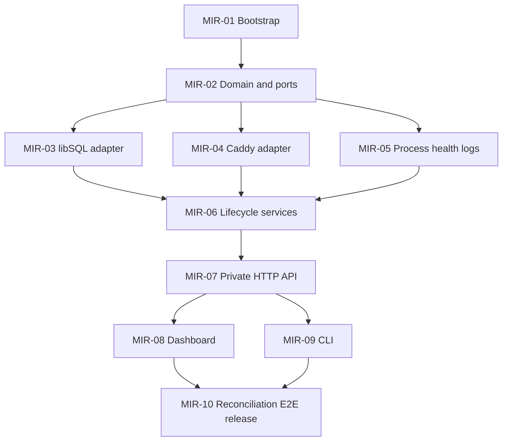

# Mirage Task Dependencies and Delivery Protocol

**Gate 0 passed:** the product owner approved `docs/usage.md` on 2026-08-12. That file is normative.

## Dependency DAG



The critical path is MIR-01 → MIR-02 → {longest of MIR-03/MIR-04/MIR-05} → MIR-06 → MIR-07 → {longest of MIR-08/MIR-09} → MIR-10.

## Safe parallelism and interface-first rules

- MIR-01 and MIR-02 are serialized and establish repository/package conventions plus all application ports.
- MIR-03, MIR-04, and MIR-05 may run in parallel only after MIR-02 is merged. They implement, but do not alter, the ports. A required port change is proposed as a small MIR-02 amendment and merged before adapter work continues.
- MIR-06 begins after all three outbound adapter tasks merge.
- MIR-08 and MIR-09 may run in parallel after MIR-07 merges. Both consume the same application/API contracts and may not reach into each other's adapter packages.
- MIR-10 is the final integration and release gate after MIR-08 and MIR-09.
- Domain and application packages never import inbound/outbound adapter packages. Composition occurs only in the executable/bootstrap layer.

## Worktree convention

For every task `MIR-XX`:

```sh
git worktree add ../mirage-worktrees/MIR-XX -b task/MIR-XX main
```

The implementer works only in that worktree. Review feedback is fixed on the same branch. After both reviews approve, rebase onto current `main`, rerun all gates, merge with `--no-ff`, then remove the worktree and branch. Parallel branches must rebase after an earlier sibling merges and rerun the complete test suite.

## Per-task delivery state machine

1. **Prepare:** verify dependencies merged; create isolated worktree/branch; copy task text and approved usage contract into the implementation brief.
2. **Implement:** Ollem GPT-5.6 Terra medium writes code/tests and produces the specified black-box artifact. It runs formatting, vet, race tests where supported, package tests, and repository coverage.
3. **Behavior review:** an independent Ollem GPT-5.6 Luna high reviewer receives a clean temporary folder containing only the built artifact or runnable product link, the exact task, and usage instructions—never the source tree. It executes acceptance and negative-path tests and returns APPROVE or REJECT with reproducible evidence.
4. **Code review:** a different independent Ollem GPT-5.6 Luna high reviewer inspects the task branch for hexagonal boundaries, correctness, security, concurrency/process cleanup, test quality, and project standards. It returns APPROVE or REJECT with file/line evidence.
5. **Repair:** any rejection blocks merge. The implementer receives both reports, fixes the branch, and both relevant reviewers rerun their reviews. Reviewers do not implement fixes.
6. **Escalation:** after two rejected implementation attempts for the same task, hand the implementation and complete feedback history to Ollem GPT-5.6 Sol low. Reviews remain Luna high.
7. **Merge:** only after both reviews approve, rebase on `main`, run `mise run check` and the task artifact again, then merge and tag the task in the delivery log.

## Global merge gates

Every merge must satisfy:

- task acceptance criteria and artifact in `docs/plan.md`;
- both independent reviewer approvals recorded under `docs/reviews/MIR-XX/`;
- `go test -cover ./...` reports at least 85% statement coverage (and no package with meaningful logic is hidden by an aggregate-only result);
- formatting, `go vet ./...`, race tests for concurrency-capable packages, and architecture dependency checks pass;
- no plaintext bearer tokens in persistence/log fixtures;
- management routes cannot be served by the public listener;
- working tree is clean and no task has silently changed approved usage.

## Merge waves

1. Wave A: MIR-01
2. Wave B: MIR-02
3. Wave C (parallel): MIR-03, MIR-04, MIR-05; merge in numeric order unless coordination requires otherwise, rebasing and retesting each.
4. Wave D: MIR-06
5. Wave E: MIR-07
6. Wave F (parallel): MIR-08, MIR-09; merge in numeric order after rebase/retest.
7. Wave G: MIR-10 and final audit.
